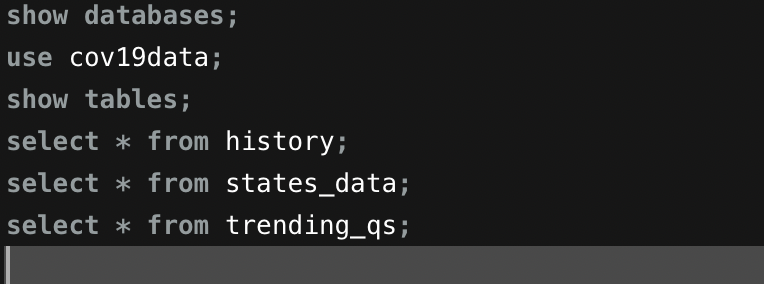
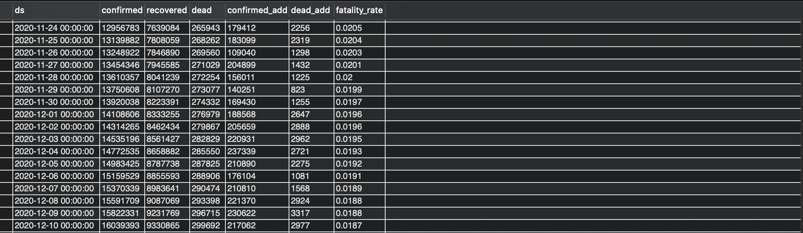
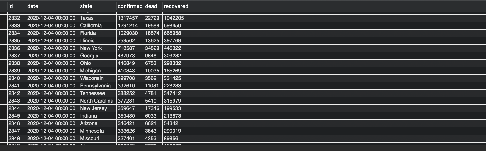
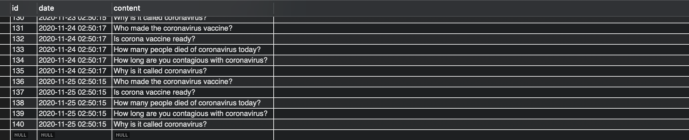

# COVID-19-Tracker

### libraries and packages I used
requests, re, json, pymysql, traceback, selenium.
### cov19dataCrawler.py
This file is used to crawl data and save it to the ec2 MySQL database and it requires Chrome and ChromeDriver to be installed. 
All data is stored in three tables.

### web page
The folder contains two ECharts templates for drawing line charts, a US map json file, word cloud library, and js file to fetch data from database.

